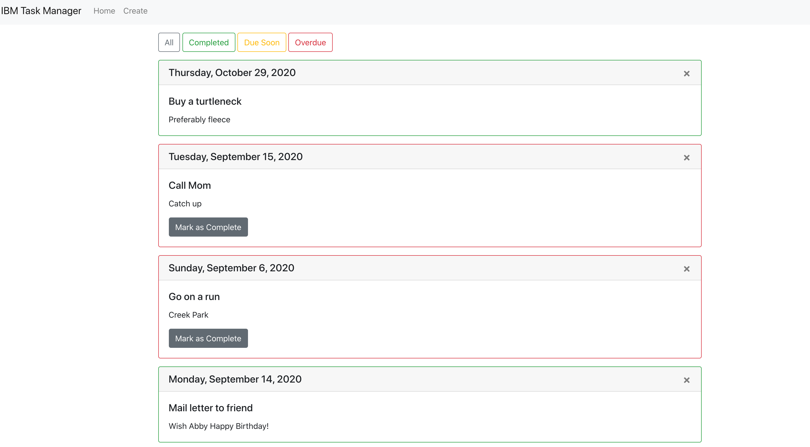

# Task Tracker
The Task Tracker is an application that allows users to manager their tasks. In addition to basic CRUD functions, filters in the app allow the user to view tasks by urgency. 

# Technologies
MongoDB, Express, React, Node.js, Docker

Testing: React Testing Library, Jest

# Running the Application
To run the frontend and backend concurrently:
  At the root level, run the command `npm i` to install the app dependencies, then run `npm run dev`  
  To run locally, go to http://localhost:3000
  
Backend: runs on port 5000
Frontend: runs on port 3000

# Future Features
- Add more robust testing on the backend
- Form validation 
- Additional filters (categorize tasks)

